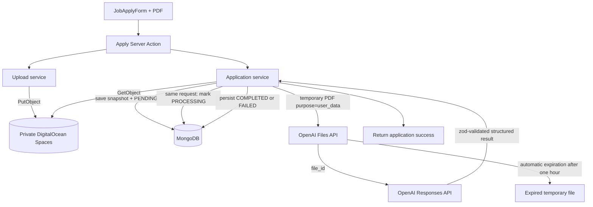

# Day 11 - File Uploading and AI Screening

## Goal

Build the simplest fully functional resume-screening flow: upload a PDF through the Next.js server to private DigitalOcean Spaces, save the application as `PENDING`, screen it synchronously during the same apply request, temporarily upload the PDF to OpenAI Files with one-hour automatic expiration, analyze it with Responses API structured output, and persist a human-reviewable result.

## Implementation Status Summary

| Lecture | Status | Notes (as implemented today) |
|---------|--------|------------------------------|
| 110 Plan | **Partial** | Pipeline mostly wired; lecture "Current State" still describes pre-upload UI |
| 111 Architecture | **Implemented** | Server-proxied private upload matches code |
| 112 Spaces setup | **Partial** | `lib/storage.ts` wired; bucket provisioning is manual |
| 113 Upload service | **Implemented** | PDF validation + PutObject |
| 114 Resume snapshot | **Implemented** | Application resume metadata fields |
| 115 Apply form upload | **Partial** | Real file input exists; drop zone commented out |
| 116 Pending/post-apply | **Partial** | Status UX wired; duplicate check TODO; service null-shape differs |
| 117 Admin details | **Implemented** | Details route + workflow/candidate components |
| 118 Secure resume access | **Partial** | Route at `dashboard/.../resume/route.ts`, not `/api/...` |
| 119 OpenAI setup | **Implemented** | `lib/openai.ts` |
| 120 OpenAI Files | **Implemented** | `openai-files.service.ts` + 1h expiration |
| 121 Analyze resume | **Implemented** | Responses API + zod structured output |
| 122 Trigger screening | **Partial** | Fire-and-forget `screenApplication`; `aiScore: 0` TODO |
| 123 Admin results UI | **Partial** | States render; `screenedAt` hidden; `aiScore ?? 0` |
| 124 Feature branch | **Planned** | Workflow doc |
| 124.1 Docker env | **Partial** | `MONGO_URI` build-arg exists; verify Spaces/OpenAI scope |
| 125 Recap | **Partial** | Target flow documented; gaps in 122–123 remain |

**Not yet matching lecture target:** synchronous `await screenApplication`, optional `aiScore`, duplicate-application guard, resume route under `/api/...`, full admin/candidate result UI (`screenedAt`, no fake zero).

Each lecture file includes `## Implementation Status`, `## Key Files (as implemented today)`, and `## Gaps vs This Lecture (if any)` near the top.

## Current Starting State

- DigitalOcean Space is provisioned.
- AWS S3 client/presigner dependencies are present.
- Upload and secure admin-access implementation begins in Lectures 110–118.
- `openai` is installed during Lecture 119, not by this documentation update.
- `OPENAI_API_KEY` and `OPENAI_MODEL` are introduced only when the OpenAI service is taught.
- The application currently uses a transitional `aiScore`; later lessons make it optional and display real completed scores on a 0–10 scale.

## Complete Lecture Sequence

- [Lecture 110 - Day (11) Plan](./lecture-110-day-11-plan.md)
- [Lecture 111 - File Upload Architecture](./lecture-111-file-upload-architecture.md)
- [Lecture 112 - Setting Up DigitalOcean Spaces](./lecture-112-setting-up-digitalocean-spaces.md)
- [Lecture 113 - Upload Service and File Validation](./lecture-113-upload-service-and-file-validation.md)
- [Lecture 114 - Prepare the Resume Snapshot](./lecture-114-prepare-resume-snapshot.md)
- [Lecture 115 - Upload Resume from Apply Form](./lecture-115-upload-resume-from-apply-form.md)
- [Lecture 116 - Pending and Post-Apply State](./lecture-116-pending-and-post-apply-state.md)
- [Lecture 117 - Application Details and Screening State in Admin](./lecture-117-display-resume-and-screening-state-in-admin.md)
- [Lecture 118 - Application Submission and Secure Resume Access](./lecture-118-application-submission-and-secure-resume-access.md)
- [Lecture 119 - OpenAI Platform Basics and API Setup](./lecture-119-openai-platform-basics-and-api-setup.md)
- [Lecture 120 - Upload Resume to OpenAI Files API](./lecture-120-upload-resume-to-openai-files-api.md)
- [Lecture 121 - Analyze Resume with OpenAI](./lecture-121-analyze-resume-with-openai.md)
- [Lecture 122 - Trigger Screening After Application Submission](./lecture-122-trigger-screening-after-application-submission.md)
- [Lecture 123 - Display Screening Results in Admin](./lecture-123-display-screening-results-in-admin.md)
- [Lecture 124 - Feature Branch for Day (11)](./lecture-124-feature-branch-for-day-11.md)
- [Lecture 124.1 - Docker Build Environment Variables](./lecture-124-1-docker-build-environment-variables.md)
- [Lecture 125 - Recap Day (11)](./lecture-125-recap-day-11.md)

## Teaching Order

```txt
110-118: make private upload, application snapshot, status, admin details,
         and authorized resume access real

119: tour OpenAI Platform and create the server-only client
120: Spaces bytes -> OpenAI Files API -> temporary file_id
121: file_id + job context -> Responses API structured result
122: save PENDING, then run screening synchronously in the apply service
123: render PENDING, PROCESSING, COMPLETED, and FAILED honestly
124: verify and ship through the branch workflow
124.1: fix Docker build-time environment-variable access on DigitalOcean
125: perform the complete verification recap
```

The order is intentional: students first prove each storage and OpenAI operation, then connect them with the smallest end-to-end orchestration. The candidate request waits while OpenAI runs. That is acceptable for this first version, but it is not production-scalable; Day 16 starts by demonstrating the resulting latency, timeout, concurrency, burst, and stranded-state problems.

## End-to-End Architecture



OpenAI PDF inputs are processed as both extracted text and page images. We do not build a local parser, OCR service, or `services/resumes` extraction layer.

## Lesson Outcomes

### 110–118: Private Resume Foundation

Students implement server-proxied upload, PDF/size validation, application resume metadata, `PENDING` status, post-apply UX, admin details, and an admin-authorized signed download route. The bucket remains private.

### 119: OpenAI Platform Setup

Tour keys, projects, billing/usage/limits, model choice, Playground, Files API, and Responses API. Install `openai`, configure `OPENAI_API_KEY`/`OPENAI_MODEL`, create `lib/openai.ts`, run a safe text smoke test, and remove the test route.

### 120–121: Current OpenAI PDF Flow

Use `GetObjectCommand` with the existing `spacesClient`/`spacesBucket`, validate bytes, convert with `toFile`, upload with purpose `user_data` and a one-hour `expires_after`, then call `openai.responses.parse` with `input_file`, `input_text`, `zodTextFormat`, and `response.output_parsed`. The temporary file may remain available until automatic expiration.

### 122: Synchronous Submission Trigger

Remove the fake score, save the application first as `PENDING`, mark it `PROCESSING`, call the Lecture 121 operation with the already-loaded job, and persist `COMPLETED` or `FAILED`. Screening failure never turns the already-saved application into a failed submission response.

### 123: Human-Readable Admin Results

Show all four screening states. Render score, summary, strengths, risks, and screening time only for `COMPLETED`; never display a fake zero.

### 124–125: Delivery, Docker Environment Fix, and Recap

Run full checks, verify private download and the OpenAI expiration metadata/lifecycle, ship through the branch workflow, fix custom-Dockerfile build-variable access when needed in Lecture 124.1, and document why Day 16 is needed.

## Environment Contract by End of Day

```txt
DO_SPACES_ENDPOINT
DO_SPACES_REGION
DO_SPACES_BUCKET
DO_SPACES_ACCESS_KEY_ID
DO_SPACES_SECRET_ACCESS_KEY
OPENAI_API_KEY
OPENAI_MODEL
```

All are server-only.

## Production Rules

- Store resume bytes in private object storage; store only trusted metadata/key in MongoDB.
- Persist the application before calling OpenAI so provider failure cannot erase the submission.
- Return application success after a screening failure; the admin sees the safe `FAILED` state.
- Use Responses API—not Assistants API or Chat Completions.
- Do not store temporary OpenAI file IDs in MongoDB.
- Set `expires_after` to one hour and rely on automatic expiration for temporary OpenAI files.
- Files may remain available until expiration; do not promise provider zero retention beyond OpenAI terms and data controls.
- Validate structured output before persistence and keep score on the UI's 0–10 scale.
- Treat AI output as decision support. Human admins remain responsible for hiring decisions.
- Accept the synchronous limitations only as a teaching-first version. Day 16 introduces durable background processing after the pain is observable.

## Official OpenAI References

- https://developers.openai.com/api/docs/guides/file-inputs
- https://developers.openai.com/api/docs/guides/structured-outputs
- https://developers.openai.com/api/reference/resources/files/
