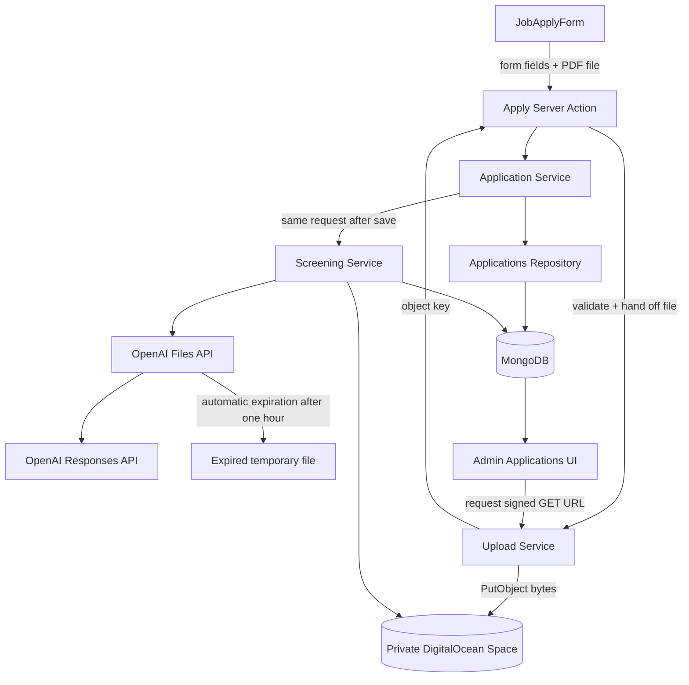
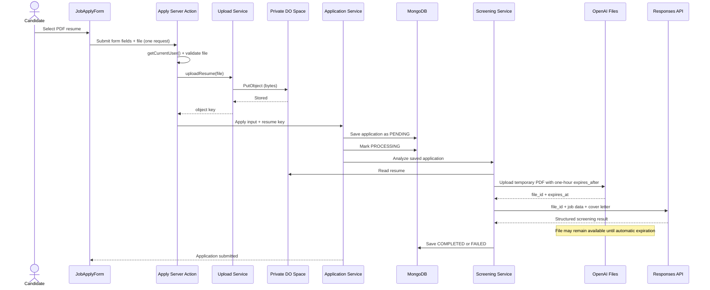

# Lecture 111 - File Upload Architecture | معمارية رفع الملفات

## Goal

Map the resume lifecycle and assign one responsibility to each layer before implementation.

## Explain It Simply (For Beginners)

There are two ways to get a file from the browser into cloud storage:

1. **Through our server** (the way we choose): browser → our server → storage. The apply form submits the file like any other field; our server validates it and uploads it to DigitalOcean Spaces.
2. **Directly to storage** (the fancier way): the browser uploads the file *straight* to Spaces after the server hands it a temporary "permission slip" (a presigned URL). The bytes never touch our server.

We pick **option 1** because it's simple and familiar: one request, one place doing the work. It's like handing a document to a clerk at the counter — they check it and file it in the back for you. Option 2 scales better (great for huge files or high traffic), but it adds an extra route, a two-step upload handshake, and bucket CORS. We name it as a **future upgrade**, not something we build now.

The cost of our choice: the file's bytes flow through our server, using a little memory, and we must raise the Next.js Server Action body limit to ~5 MB. For a course and a 5 MB resume cap, that's a fine trade.

**Why not just make the files public?** Resumes contain personal data (names, phone numbers, addresses). A public URL means anyone who guesses the link can read someone's resume. So files stay private, and admins get short-lived **signed download links** on demand. Note the asymmetry: *upload* is simple (through our server), but *download* still uses temporary signed links because the bucket is private.

### Jargon decoder

- **Object key** = the file's address inside the bucket, e.g. `resumes/abc-123.pdf`. We store *this* on the application, not the whole file.
- **`PutObject` / `GetObject`** = the S3 commands to upload a file and to read one.
- **Signed GET URL** = a temporary link that lets someone download one specific private file for a few minutes.
- **Presigned (PUT) URL** = the *upload* version of that idea, used only in the option-2 direct-upload approach we are **not** building.
- **Layer** = one part of the code with one job. Keeping jobs separate makes each piece easy to understand and test.

## Architecture Decision

Use a **private Space with server-proxied uploads**:

- The apply Server Action authenticates the candidate, validates the file, and uploads it to Spaces.
- MongoDB stores the object key and metadata, not the file bytes.
- Admin downloads use short-lived signed GET URLs.

We deliberately send the file through our server (not a presigned direct upload) because it keeps the flow to a single request, reuses the existing Server Action pattern, and needs no bucket CORS. The trade-off is server memory/bandwidth per upload plus raising the Server Action `bodySizeLimit`. **Presigned direct upload is the scaling upgrade to reach for later**, when server bandwidth becomes the real pain point.

## Architecture Diagram



## Sequence Diagram



## Layer Responsibilities

```txt
JobApplyForm
  -> collect file
  -> submit form + file in one normal Server Action request

Apply Server Action
  -> require authenticated candidate (getCurrentUser)
  -> hand the file to the upload service
  -> save the returned key with the application

Upload service
  -> validate the file (PDF, size)
  -> generate a server-owned object key
  -> upload bytes to Spaces (PutObject)
  -> sign short-lived GET URLs for admin downloads

Application service
  -> validate application
  -> save resume snapshot metadata
  -> save PENDING before screening
  -> invoke screening in the same request

Repository
  -> persist plain application data only

Screening service
  -> fetch object
  -> upload temporary PDF to OpenAI Files with one-hour expiration
  -> call Responses API with file_id
  -> rely on automatic file expiration
  -> persist status/result
```

## Recording Steps

1. Revisit the fake upload UI from Lecture 110.
2. Draw the architecture diagram.
3. Compare server-proxied upload and direct presigned upload.
4. Choose server-proxied upload for simplicity; name presigned as the scaling upgrade.
5. Walk through each layer’s responsibility.
6. Walk through the sequence diagram.
7. Connect the stored object key to admin downloads and AI processing.
8. Name the deliberate limitation: the candidate request waits for OpenAI. Day 16 introduces durable background processing after students can observe why it is needed.

## Key Teaching Lines

> The file flows through our server; the server validates, uploads, and owns the object key.

> The browser never holds storage credentials, and downloads use short-lived signed GET URLs.

> The file lives in Spaces. MongoDB stores how to find and describe it.

> Presigned direct upload is the scaling upgrade for later, not a requirement now.

## Next

Lecture 112 verifies the private Space, credentials, endpoints, and local/deployment environment variables (bucket CORS is only needed if you later switch to direct browser upload).
