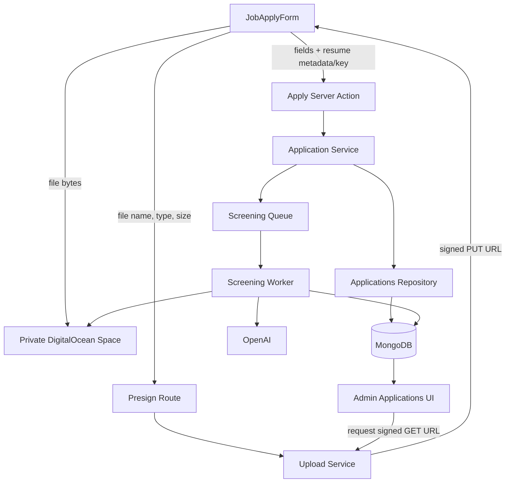
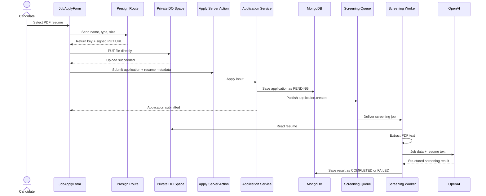

# Lecture 111 - File Upload Architecture | معمارية رفع الملفات

## Goal

Map the resume lifecycle and assign one responsibility to each layer before implementation.

## Architecture Decision

Use a **private Space with presigned URLs**:

- The server validates upload intent and creates a short-lived signed PUT URL.
- The browser uploads the file directly to DigitalOcean Spaces.
- MongoDB stores the object key and metadata, not the file bytes.
- Admin downloads use short-lived signed GET URLs.

This is preferred over sending a 5 MB file through a Server Action because it avoids request body limits, server memory usage, and unnecessary bandwidth through the Next.js server.

## Architecture Diagram



## Sequence Diagram



## Layer Responsibilities

```txt
JobApplyForm
  -> collect file
  -> request signed upload
  -> upload directly to Spaces
  -> submit returned key/metadata

Presign route
  -> require authenticated candidate
  -> validate file metadata
  -> generate server-owned object key
  -> return short-lived signed URL

Upload service
  -> configure S3-compatible commands
  -> create signed PUT/GET operations

Application service
  -> validate application
  -> save resume snapshot metadata
  -> create pending screening job

Repository
  -> persist plain application data only

Screening worker
  -> fetch object
  -> extract text
  -> call OpenAI
  -> persist status/result
```

## Recording Steps

1. Revisit the fake upload UI from Lecture 110.
2. Draw the architecture diagram.
3. Compare server-proxied upload and direct presigned upload.
4. Choose private presigned uploads and explain why.
5. Walk through each layer’s responsibility.
6. Walk through the sequence diagram.
7. Connect the stored object key to admin downloads and AI processing.

## Key Teaching Lines

> The browser uploads bytes; the server grants limited permission.

> The form must not know storage credentials. It receives a temporary signed URL.

> The file lives in Spaces. MongoDB stores how to find and describe it.

## Next

Lecture 112 verifies the private Space, credentials, endpoints, CORS, and local/deployment environment variables.
