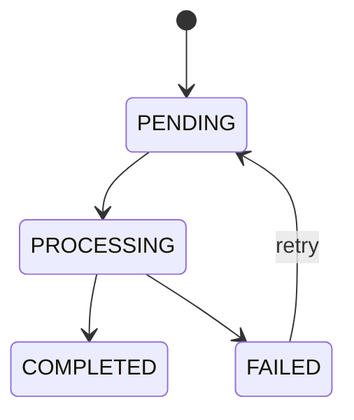

# Lecture 122 - Screening Status and Failure States | حالات التقييم ومعالجة الأخطاء

## Goal

Make asynchronous screening observable, retryable, and honest in both code and UI.

## State Machine



## Step 1 - Define State Meaning

```txt
PENDING
  -> application saved; waiting for worker

PROCESSING
  -> worker claimed the job

COMPLETED
  -> validated AI result persisted

FAILED
  -> processing stopped after allowed attempt
```

## Step 2 - Classify Failures

Retryable:

- transient OpenAI error
- rate limit
- temporary network/storage error

Non-retryable:

- missing resume object
- unsupported/corrupt PDF
- no extractable text
- invalid application/job data

## Step 3 - Store Safe Failure Information

Persist a safe operational code/message:

```txt
screeningErrorCode
screeningError
screeningAttempts
```

Do not store secrets, full provider responses, or resume content in errors.

## Step 4 - Configure Queue Retries

- bounded attempts
- exponential backoff when supported
- idempotent worker
- dead-letter/final failure behavior

Ensure a retry transitions the record safely without creating duplicate results.

## Step 5 - Build Admin Status UX

- pending badge
- processing badge/spinner
- completed result
- failed message
- optional authorized retry action

Even if screening is automatic, a retry operation can be an admin recovery tool; it is not the normal trigger.

## Step 6 - Candidate UX

Application submission should confirm success once the application is saved/queued. Candidates should not wait for or see internal AI errors during submission.

## Step 7 - Handle Stuck Jobs

Discuss a reconciliation task:

- find `PROCESSING` records older than a threshold
- reset/requeue safely
- monitor unusually old `PENDING` records

This may be production follow-up rather than full Day 11 implementation.

## Verification

- transient failure retries
- corrupt PDF becomes `FAILED`
- candidate application remains saved
- admin sees correct status
- retry cannot duplicate a completed result
- stale processing state is detectable

## Key Teaching Lines

> Async work needs states, not a loading boolean.

> Screening failure is not application failure.

## Next

Lecture 123 packages Day 11 work into its feature branch and validates deployment configuration.
