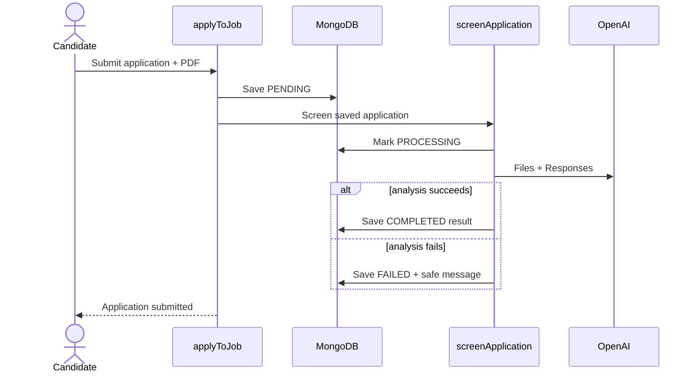

# Lecture 122 - Trigger Screening After Application Submission | تشغيل التقييم بعد إرسال الطلب

## Goal
Connect the proven Lecture 121 operation to the real apply flow with the smallest functional architecture:

```txt
save application as PENDING
  -> mark PROCESSING
  -> analyze resume during the same request
  -> persist COMPLETED or FAILED
  -> return application submission success
```

There is no separate delivery system in this version. The candidate's request remains open while Spaces and OpenAI run. That makes the flow easy to understand and fully functional, but it also adds latency, timeout, burst, and concurrency limits. Day 16 begins by measuring those problems before changing the architecture.

The most important business rule is:

> Once the application is saved, screening failure must never tell the candidate that the application failed.

Otherwise the candidate may submit again and create a duplicate application.

## Implementation Status
**Partial** — Screening orchestration exists but apply flow differs from the lecture's synchronous await design.

## Key Files (as implemented today)
- `services/screening/screening.service.ts`
- `services/applications/applications.service.ts`
- `repositories/applications.repository.ts`
- `types/Application.ts`
- `lib/models/application.model.ts`

## Gaps vs This Lecture (if any)
- **Fire-and-forget:** `applyToJob` calls `screenApplication({ application, job })` **without `await`**. Screening runs in the background; the candidate response does not wait for OpenAI (unlike the lecture's synchronous timeline).
- **`aiScore: 0` TODO remains** on new applications (`//TODO: Removed after AI screening is implemented`). Lecture removes this and makes `aiScore` optional.
- `types/Application.ts` still has `aiScore: number` required; Mongoose schema still has `aiScore: { required: true }`.
- No try/catch logging block around awaited screening in `applyToJob` — failures are handled inside `screenApplication` but the HTTP response may return before screening finishes.

## As Implemented Today
```ts
// services/applications/applications.service.ts (actual)
screenApplication({ application: newApplication, job });
return { success: true, data: newApplication };
```

The lecture teaches `await screenApplication(...)` inside a try/catch so the same request waits for COMPLETED/FAILED. Today screening still runs, but the apply response can return while status is still `PENDING`/`PROCESSING`, and the returned `newApplication` object will not include updated screening fields. Lecture documents synchronous await; repository currently uses fire-and-forget.

## Implementation steps
See steps below (Step 1–6). Summary:

1. Make `aiScore` optional in `types/Application.ts` and Mongoose schema (remove `required: true`).
2. Add screening result fields: `aiSummary`, `aiStrengths`, `aiRisks`, `screeningError`, `screenedAt`.
3. Update `toApplication` mapper — convert `screenedAt` Date → string.
4. Add `updateApplicationScreening` in repository with focused `ApplicationScreeningUpdate` type.
5. Create `services/screening/screening.service.ts` — `PROCESSING` → analyze → `COMPLETED` or `FAILED` with safe error message.
6. In `applyToJob`: remove `aiScore: 0`; after `saveNewApplication`, trigger screening.

**As implemented today (gaps vs lecture target):**

```ts
// services/applications/applications.service.ts (actual)
aiScore: 0, // TODO: Removed after AI screening is implemented
screenApplication({ application: newApplication, job }); // no await, no try/catch
return { success: true, data: newApplication };
```

Lecture target:

```ts
try {
  await screenApplication({ application: newApplication, job });
} catch (error) {
  console.error("Application screening failed after submission", { applicationId: newApplication.id, ... });
}
return { success: true, data: newApplication };
```

## Step 1 - Extend the Application Contract
Update `types/Application.ts`. Make `aiScore` optional, then add the structured result, safe failure message, and completion time:

```ts
import type { ScreeningStatus } from "./ScreeningStatus";

export interface Application {
  id: string;
  candidateId: string;
  candidateName: string;
  candidateEmail: string;
  candidateLinkedin: string;
  candidateCoverLetter: string;
  candidateResumeKey?: string;
  candidateResumeFileName?: string;
  candidateResumeSize?: number;
  candidateResumeContentType?: string;
  jobId: string;
  jobTitle: string;
  jobCompany: string;
  role: string;
  aiScore?: number;
  aiSummary?: string;
  aiStrengths?: string[];
  aiRisks?: string[];
  screeningError?: string;
  screeningStatus: ScreeningStatus;
  screenedAt?: string;
  status: "SUBMITTED" | "REVIEW" | "SHORTLIST" | "INTERVIEW" | "REJECTED";
  appliedDate: string;
  coverLetter?: string;
}
```

An absent score means “there is no completed result.” It does not mean zero.

## Step 2 - Extend the Mongoose Schema
In `lib/models/application.model.ts`, replace the required score field and add the result fields:

```ts
aiScore: { type: Number, min: 0, max: 10 },
aiSummary: { type: String },
aiStrengths: [{ type: String }],
aiRisks: [{ type: String }],
screeningError: { type: String },
screeningStatus: {
  type: String,
  enum: ["PENDING", "PROCESSING", "COMPLETED", "FAILED"],
  default: "PENDING",
  required: true,
},
screenedAt: { type: Date },
```

Keep hiring `status` separate. `screeningStatus` describes the external analysis workflow; `status` describes the human hiring workflow.

## Step 3 - Convert `screenedAt` in the Repository Mapper
Dates and ObjectIds must not leave the repository. Update the lean type and mapper in `repositories/applications.repository.ts`:

```ts
type ApplicationLean = Omit<
  Application,
  "id" | "appliedDate" | "screenedAt"
> & {
  _id: { toString(): string };
  __v?: number;
  appliedDate: string | Date;
  screenedAt?: string | Date;
};

function toApplication(doc: ApplicationLean): Application {
  const {
    _id,
    __v,
    candidateId,
    jobId,
    appliedDate,
    screenedAt,
    ...rest
  } = doc;

  return {
    id: _id.toString(),
    candidateId: candidateId.toString(),
    jobId: jobId.toString(),
    appliedDate:
      appliedDate instanceof Date
        ? appliedDate.toISOString().split("T")[0]
        : String(appliedDate),
    ...(screenedAt
      ? {
          screenedAt:
            screenedAt instanceof Date
              ? screenedAt.toISOString()
              : String(screenedAt),
        }
      : {}),
    ...rest,
  };
}
```

Also ensure `saveNewApplication` returns the mapped entity rather than a Mongoose document:

```ts
export async function saveNewApplication(
  application: Omit<Application, "id" | "appliedDate">,
): Promise<Application> {
  await dbConnect();

  const newApplication = await ApplicationModel.create({
    ...application,
    candidateId: new ObjectId(application.candidateId),
    jobId: new ObjectId(application.jobId),
  });

  return toApplication(newApplication.toObject() as ApplicationLean);
}
```

## Step 4 - Add One Screening Update Function
The repository does not need a separate function for every status. Add one focused update type and one function to `repositories/applications.repository.ts`:

```ts
type ApplicationScreeningUpdate = {
  screeningStatus: Application["screeningStatus"];
  aiScore?: number;
  aiSummary?: string;
  aiStrengths?: string[];
  aiRisks?: string[];
  screeningError?: string;
  screenedAt?: Date;
};

export async function updateApplicationScreening(
  applicationId: string,
  update: ApplicationScreeningUpdate,
): Promise<Application | null> {
  await dbConnect();

  const application = await ApplicationModel.findByIdAndUpdate(
    applicationId,
    { $set: update },
    { new: true },
  ).lean<ApplicationLean>();

  return application ? toApplication(application) : null;
}
```

This function is still focused: callers may update screening fields, but they cannot accidentally change candidate, job, or hiring-status fields.

The service decides whether the update represents `PROCESSING`, `COMPLETED`, or `FAILED`. Never pass raw provider errors as `screeningError`; choose a safe application message first.

## Step 5 - Create the Synchronous Orchestration Service
Create `services/screening/screening.service.ts`:

```ts
import "server-only";
import type { Application, Job } from "@/types";
import { updateApplicationScreening } from "@/repositories/applications.repository";
import { analyzeApplicationResume } from "./openai-screening.service";

const SAFE_SCREENING_ERROR =
  "Screening could not be completed. The application was still submitted.";

type ScreeningInput = {
  application: Application;
  job: Job;
};

export async function screenApplication({
  application,
  job,
}: ScreeningInput): Promise<void> {
  const processing = await updateApplicationScreening(application.id, {
    screeningStatus: "PROCESSING",
  });

  if (!processing) {
    throw new Error("Application was not found before screening");
  }

  try {
    const result = await analyzeApplicationResume({
      application: processing,
      job,
    });

    const completed = await updateApplicationScreening(application.id, {
      screeningStatus: "COMPLETED",
      aiScore: result.score,
      aiSummary: result.summary,
      aiStrengths: result.strengths,
      aiRisks: result.risks,
      screenedAt: new Date(),
    });

    if (!completed) {
      throw new Error("Application disappeared while saving screening result");
    }
  } catch (error) {
    await updateApplicationScreening(application.id, {
      screeningStatus: "FAILED",
      screeningError: SAFE_SCREENING_ERROR,
    });

    throw error;
  }
}
```

`analyzeApplicationResume` uploads through Lecture 120's helper, so every temporary OpenAI file receives the one-hour `expires_after` policy. Do not persist the temporary OpenAI file ID.

## Step 6 - Trigger Screening After Persistence
In `services/applications/applications.service.ts`, import the orchestrator:

```ts
import { screenApplication } from "@/services/screening/screening.service";
```

Remove `aiScore: 0` from the object passed to `saveNewApplication`. The final save-and-screen block inside `applyToJob` is:

```ts
const newApplication = await saveNewApplication({
  ...validated.data,
  candidateId: currentUser.id,
  candidateResumeKey: resume.key,
  candidateResumeFileName: resume.fileName,
  candidateResumeSize: resume.fileSize,
  candidateResumeContentType: resume.contentType,
  jobTitle: job.title,
  jobCompany: job.company,
  role: job.title,
  screeningStatus: "PENDING",
  status: "SUBMITTED",
});

try {
  await screenApplication({
    application: newApplication,
    job, // reuse the job already loaded near the start of applyToJob
  });
} catch (error) {
  console.error("Application screening failed after submission", {
    applicationId: newApplication.id,
    message: error instanceof Error ? error.message : "Unknown error",
  });
}

return { success: true, data: newApplication };
```

The ordering is deliberate:

1. Upload the resume.
2. Persist the application as `PENDING`.
3. Start screening.
4. Catch screening failure.
5. Return application success.

Do not return `errors.resume`, `errors.application`, or a generic submission failure after step 2. The application exists and the duplicate check should prevent a second submission.

## Request Timeline


The response waits for the entire diagram. This is the known limitation, not an accidental claim of scalability.

## Verification
Run:

```bash
npx tsc --noEmit
npm run lint
```

Then test:

1. Successful screening moves `PENDING -> PROCESSING -> COMPLETED`.
2. `aiScore` is between 0 and 10 and result fields are present.
3. `screenedAt` is stored as a date and returned as a string.
4. The temporary OpenAI file reports an `expires_at` about one hour after creation and expires automatically.
5. With an invalid OpenAI key or controlled provider failure, the application remains saved and becomes `FAILED`.
6. The candidate still reaches the submitted state after that failure.
7. A repeated submission is rejected as a duplicate rather than encouraged by a false submission error.
8. No document stores a fake `aiScore: 0`.

## Design Caveats
- The candidate waits for OpenAI, so submission latency rises.
- Platform request timeouts can interrupt the request.
- Bursts consume application-server and provider concurrency.
- A process interruption can leave a record in `PENDING` or `PROCESSING`.
- Day 11 accepts these limits to teach one complete flow. Day 16 adds durable delivery, atomic claims, retries, and reconciliation after reproducing the pain safely.

## Next
Lecture 123 renders the four states and reveals completed results only when they really exist.
