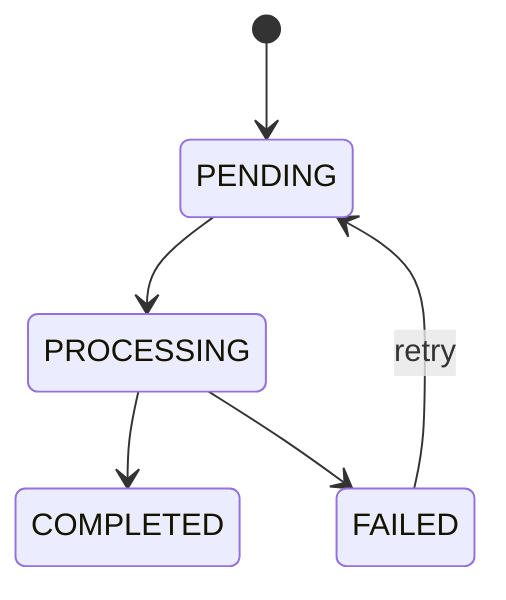

# Lecture 125 - Model Screening Failures | نمذجة أخطاء التقييم

## Goal

One small win: make screening honest in **code** — a clear state machine, a rule for which failures are worth retrying, and a safe place to record what went wrong. (Showing this to humans is the next lesson.)

## Explain It Simply (For Beginners)

Background work fails sometimes — OpenAI is busy, a PDF is corrupt, the network blips. The temptation is to hide it behind an endless spinner. Instead we make failure a first-class, honest state.

The core idea: async work needs **states, not a loading boolean.** "loading: true/false" can't tell "still waiting" from "currently working" from "broke." So we use a small **state machine**:



Two distinctions students must get:

- **Retryable vs non-retryable.** A rate limit is temporary — try again. A resume with zero extractable text will *never* work — mark it `FAILED` and stop. Blindly retrying broken input just wastes money.
- **Screening failure is NOT application failure.** If the AI step breaks, the candidate's application is still safely saved. We never delete it because *our* AI had a bad day.

We also store only **safe** error info (a short code/message), never secrets, raw provider dumps, or resume content.

### Jargon decoder

- **State machine** = a defined set of statuses plus the allowed moves between them.
- **Backoff / exponential backoff** = waiting longer and longer between retries so we don't hammer a struggling service.
- **Dead-letter** = where a job goes after it has failed the maximum number of times, for humans to inspect.
- **Reconciliation** = a periodic sweep that finds and fixes stuck/abandoned jobs.

## Step 1 - Define State Meaning

```txt
PENDING     -> application saved; waiting for worker
PROCESSING  -> worker claimed the job
COMPLETED   -> validated AI result persisted
FAILED      -> processing stopped after allowed attempt
```

## Step 2 - Classify Failures

Retryable:

- transient OpenAI error
- rate limit
- temporary network/storage error

Non-retryable:

- missing resume object
- unsupported/corrupt PDF
- no extractable text
- invalid application/job data

## Step 3 - Store Safe Failure Information

Persist a safe operational code/message:

```txt
screeningErrorCode
screeningError
screeningAttempts
```

Do not store secrets, full provider responses, or resume content in errors.

## Step 4 - Configure Queue Retries

- bounded attempts
- exponential backoff when supported
- idempotent worker (from Lecture 122)
- dead-letter/final failure behavior

Ensure a retry transitions the record safely without creating duplicate results.

## Step 5 - Name the Stuck-Job Problem

Discuss a reconciliation task (may be production follow-up rather than full Day 11 implementation):

- find `PROCESSING` records older than a threshold
- reset/requeue safely
- monitor unusually old `PENDING` records

## Verification

- A transient failure retries.
- A corrupt PDF becomes `FAILED` and stops.
- The candidate application remains saved regardless.
- A retry cannot duplicate a completed result.

## Key Teaching Lines

> Async work needs states, not a loading boolean.

> Screening failure is not application failure.

## Next

Lecture 126 shows these states to admins and candidates in the UI.
