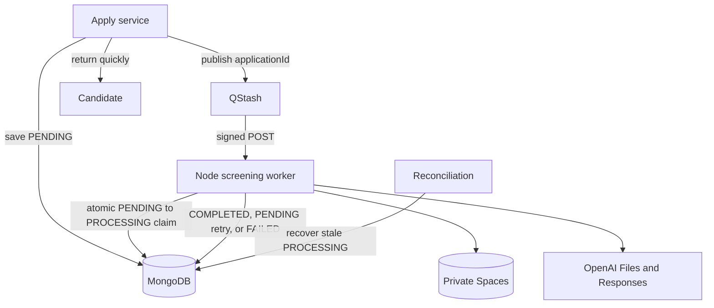

# Day 16 - Scalable AI Screening

## Goal

Start with the measured limits of Day 11's synchronous screening request, then move the already-proven OpenAI operation behind durable delivery and a protected worker.

Day 16 does not change the PDF-processing direction:

```txt
private Spaces bytes
  -> temporary OpenAI Files user_data file with one-hour expires_after
  -> Responses API structured output
  -> automatic expiration after one hour
```

It changes **when and where** that operation runs.

## Planning Status

This day is planned. Final Udemy lecture numbers remain TBD until Days 13–15 receive numbers, so files use `lesson-01` naming.

Before recording, recheck the current `@upstash/qstash` package documentation and types. The planned patterns are:

```ts
new Client({ token }).publishJSON({ url, body, retries })
```

and:

```ts
verifySignatureAppRouter(handler)
```

## Lesson Sequence

1. [The Burst and Timeout Problem](./lesson-01-burst-and-timeout-problem.md)
2. [Durable Queue Architecture](./lesson-02-durable-queue-architecture.md)
3. [Publish Screening Jobs with QStash](./lesson-03-publish-screening-jobs-with-qstash.md)
4. [Protected Screening Worker Route](./lesson-04-protected-screening-worker-route.md)
5. [Idempotent Worker and Atomic Claim](./lesson-05-idempotent-worker-and-atomic-claim.md)
6. [Retries and Failure Recovery](./lesson-06-retries-and-failure-recovery.md)
7. [Screening Status UX Under Background Processing](./lesson-07-screening-status-ux.md)
8. [Feature Branch for Day 16](./lesson-08-feature-branch.md)
9. [Recap Day 16](./lesson-09-recap.md)

## Target Architecture



## Environment Contract

Day 11's Spaces and OpenAI variables remain. Day 16 adds:

```txt
QSTASH_TOKEN
QSTASH_CURRENT_SIGNING_KEY
QSTASH_NEXT_SIGNING_KEY
APP_BASE_URL
```

All are server-only. `APP_BASE_URL` must be an externally reachable application origin for QStash delivery; localhost requires an approved tunnel only during local development.

## Non-Negotiable Rules

- Payload is exactly `{ applicationId }`; never send resume bytes, PII, object keys, cover letters, or temporary OpenAI file IDs.
- Save the application before publishing.
- If publish fails after save, keep candidate submission successful and record/repair the dispatch gap.
- Verify the QStash signature before processing.
- Validate the payload after signature verification.
- Atomically claim only `PENDING -> PROCESSING`; duplicate delivery becomes a no-op.
- Return retryable failures to `PENDING`; store safe `FAILED` state for permanent failures.
- Keep Lecture 120's one-hour `expires_after` lifecycle in the worker's reused upload operation.
- A failed attempt may leave its temporary file available only until automatic expiration; do not persist its file ID.
- Treat AI output as decision support, never automatic rejection.

## End State

Application submission returns quickly after persistence and dispatch. Screening runs independently with verified delivery, duplicate protection, retry classification, stale-state recovery, and honest asynchronous UI.
