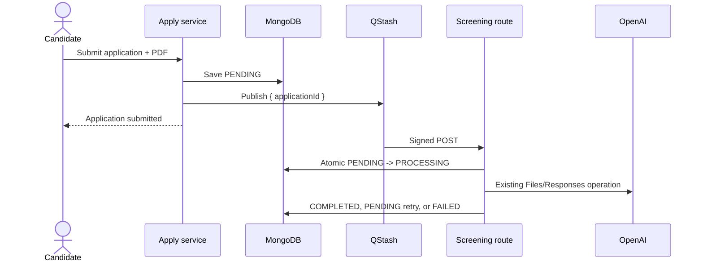

# Lesson 02 - Durable Queue Architecture

## Goal

Separate the short application-submission request from long screening work, and define the smallest safe delivery contract.

## Architecture



The application ID is a durable pointer. The worker reloads trusted application and job data from MongoDB.

## Implementation Status

**Planned — not in codebase** (QStash worker, atomic claims, async screening UX)

## Step 1 - Create the Payload Schema

Create `services/screening/screening-job.validation.ts`:

```ts
import { z } from "zod";

export const screeningJobSchema = z
  .object({
    applicationId: z.string().min(1, "Application ID is required"),
  })
  .strict();

export type ScreeningJob = z.infer<typeof screeningJobSchema>;
```

`.strict()` rejects accidental extra fields before the contract grows into a bag of private data.

## Step 2 - Export a Parsing Helper

Add:

```ts
export function parseScreeningJob(input: unknown): ScreeningJob {
  return screeningJobSchema.parse(input);
}
```

The publisher uses the inferred type; the worker validates untrusted JSON with the schema.

## Step 3 - Define the Privacy Boundary

Allowed payload:

```json
{ "applicationId": "67f..." }
```

Never publish:

```json
{
  "candidateEmail": "candidate@example.com",
  "coverLetter": "...",
  "resumeKey": "resumes/...",
  "resumeBytes": "...",
  "openaiFileId": "file_..."
}
```

Reasons:

- Queue logs and dashboards should contain minimal data.
- Application/job snapshots can change only through trusted persistence.
- Resume bytes already have a private source of truth in Spaces.
- OpenAI file IDs are temporary, not persisted, and governed by one-hour automatic expiration.
- A small payload is easy to validate and redeliver.

## Step 4 - Assign Responsibilities

```txt
Apply service
  -> upload resume
  -> save application PENDING
  -> publish applicationId
  -> return quickly

QStash
  -> durably deliver signed HTTP request
  -> retry according to configured policy

Worker route
  -> verify signature
  -> validate payload
  -> hand off to screening process service

Screening process service
  -> atomically claim PENDING
  -> reload application and job
  -> call Lecture 121 analysis
  -> persist transition
```

## Step 5 - Record the Dual-Write Gap

Two durable writes occur:

```txt
MongoDB save succeeds
QStash publish fails
```

There is no transaction across MongoDB and QStash. The application must remain submitted, and a reconciliation path must later find undispatched `PENDING` records.

For this day:

- save first
- attempt publish
- log/record dispatch failure safely
- return candidate success
- add reconciliation in Lesson 06

A transactional outbox is a future hardening option, not hidden as something already implemented.

## Verification

Use a temporary unit test or Node REPL:

```ts
screeningJobSchema.parse({ applicationId: "abc" }); // succeeds
screeningJobSchema.parse({ applicationId: "" }); // fails
screeningJobSchema.parse({
  applicationId: "abc",
  candidateEmail: "private@example.com",
}); // fails because schema is strict
```

Then run:

```bash
npx tsc --noEmit
npm run lint
```

## Next

Lesson 03 installs QStash, publishes the minimal payload after persistence, and returns submission success without waiting for screening.
